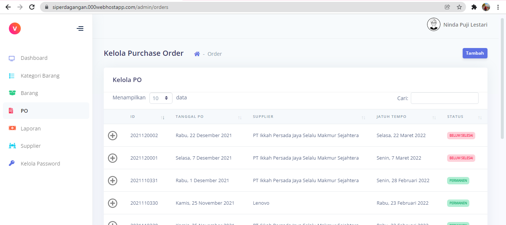
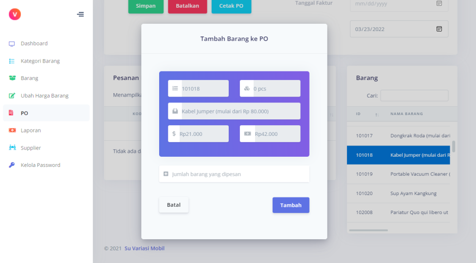

# Sisten Informasi Perdagangan (Sindag)
Website Sindag berfungsi sebagai aplikasi pengelola pencatatan barang dan kasir. Aplikasi ini dibuat sebagai tugas akhir dari Mata Kuliah Proyek Perangkat Lunak.

## Latar Belakang
Usaha dagang merupakan bentuk transaksi jual beli barang dengan tujuan memperoleh keuntungan, yang melibatkan pengelolaan barang, transaksi penjualan, serta pemantauan stok barang dan pendapatan. Di Kota Bengkulu, terdapat Su Variasi Mobil, sebuah usaha dagang yang belum memiliki sistem pengelolaan barang yang efisien dan terintegrasi. Proses pencatatan data barang masih dilakukan secara manual, tanpa pemantauan stok barang yang akurat. Untuk mengatasi masalah tersebut, pengadaan sistem informasi perdagangan yang meliputi manajemen inventaris dan manajemen kasir menjadi langkah yang diperlukan. Dengan adanya sistem informasi perdagangan berbasis website, diharapkan pengelolaan barang dan transaksi perdagangan menjadi lebih mudah, efektif, dan efisien, serta dapat membantu pengambilan keputusan pengadaan barang. Perkembangan teknologi yang pesat saat ini dapat dimanfaatkan sebagai alat untuk memudahkan pekerjaan manusia.

## Batasan Masalah
1.	Sistem yang dibangun berbasis website, tepatnya menggunakan framework CodeIgniter.
2.	Sistem terdiri atas subsistem inventaris barang yang mengelola data barang, termasuk supplier, kategori, pemesanan/pengadaan barang dan laporan, serta subsistem kasir yang menangani pencatatan transaksi penjualan.
3.	Sistem hanya diaplikasikan oleh admin dan kasir.

## Metodologi
Dalam pengembangan aplikasi ini, proses pencarian fakta guna mengumpulkan data untuk pengembangan sistem dilakukan dengan menggunakan metode:
1.	Observasi
2.	Wawancara

## Hasil Implementasi
1.	Tampilan Menu Login Admin dan Kasir

2.	Tampilan Menu Dashboard Admin

3.	Admin-Menu Kelola Kategori Barang

4.	Admin-Menu Kelola Barang

5.	Admin-Menu Ubah Harga Barang

6.	Admin-Menu Kelola Purchase Order

7.	Admin-Menu Kelola Laporan

8.	Admin-Menu Kelola Supplier

9.	Admin-Menu Kelola Password Kasir

10.	Kasir-Menu Kelola Transaksi

## Hasil Pengujian dengan Metode Blackbox
|     No.    |     Kasus/ Diuji                                 |     Skenario                                                                                                                                                                                                                                                 |     Hasil yang diharapkan                                                                                                                                                                                                                                                                                                                                        |     Hasil pengujian    |
|------------|--------------------------------------------------|--------------------------------------------------------------------------------------------------------------------------------------------------------------------------------------------------------------------------------------------------------------|------------------------------------------------------------------------------------------------------------------------------------------------------------------------------------------------------------------------------------------------------------------------------------------------------------------------------------------------------------------|------------------------|
|     1      |     Masuk                                        |     Memasukkan username dan password dengan benar                                                                                                                                                                                                            |     Sistem akan menerima username dan password dari pengguna. Apabila   username dan password cocok dan terdaftar di database sebagai admin atau   kasir, sistem akan meneruskan ke halaman dasbor dengan role yang sesuai.   Apabila email dan password cocok dan terdaftar di database sebagai admin,   sistem akan meneruskan ke halaman dashboard admin.     |     Berhasil           |
|     2      |     Profile (Admin)                              |     Menekan menu profile pada hamburger menu dan mengubah data yang tertera   pada halaman tujuan                                                                                                                                                            |     Admin dapat mengubah profile atau data diri.                                                                                                                                                                                                                                                                                                                 |     Berhasil           |
|     3      |     Lihat Kategori Barang (Admin)                |     Menekan menu kategori barang yang terdapat pada navigasi sidebar                                                                                                                                                                                         |     Admin dapat melihat daftar kategori barang yang terdapat pada sistem                                                                                                                                                                                                                                                                                         |     Berhasil           |
|     4      |     Tambah Kategori Barang (Admin)               |     Menekan tombol tambah yang terdapat pada halaman transaksi, setelah itu   membuat nota baru dan menambahkan barang yang dibeli ke dalam nota                                                                                                             |     Admin dapat membuat kategori barang baru                                                                                                                                                                                                                                                                                                                     |     Berhasil           |
|     5      |     Hapus Kategori Barang (Admin)                |     Menekan tombol hapus pada salah satu kategori barang pada tabel                                                                                                                                                                                          |     Admin dapat menghapus data kategori barang                                                                                                                                                                                                                                                                                                                   |     Berhasil           |
|     6      |     Ubah Kategori Barang (Admin)                 |     Menekan tombol ubah pada salah satu kategori, kemudian mengubah data yang   ada                                                                                                                                                                          |     Admin dapat mengubah data kategori barang                                                                                                                                                                                                                                                                                                                    |     Berhasil           |
|     7      |     Lihat Data Barang (Admin)                    |     Menekan menu barang yang terdapat pada navigasi sidebar. Selain itu,   admin juga dapat melihat detail data barang (harga jual dan harga dasar)   dengan menekan tombol detail yang ada di samping id barang                                             |     Admin dapat melihat daftar barang yang ada di dalam sistem beserta   rincian datanya                                                                                                                                                                                                                                                                         |     Berhasil           |
|     8      |     Tambah Data Barang (Admin)                   |     Menekan tombol tambah yang terdapat pada halaman barang, setelah itu   memasukkan data barang yang ingin ditambahkan ke dalam sistem. Jika sudah,   tekan tombol tambah.                                                                                 |     Admin dapat menambah data barang baru. Jika data yang dimasukkan pengguna   sudah sesuai, maka data akan ditambahkan ke dalam database                                                                                                                                                                                                                       |     Berhasil           |
|     9      |     Hapus Data Barang (Admin)                    |     Menekan tombol hapus di salah satu barang pada tabel                                                                                                                                                                                                     |     Admin dapat menghapus data barang                                                                                                                                                                                                                                                                                                                            |     Berhasil           |
|     10     |     Ubah Data Barang (Admin)                     |     Menekan tombol ubah pada salah satu barang, kemudian mengubah data yang   ada                                                                                                                                                                            |     Admin dapat mengubah data barang                                                                                                                                                                                                                                                                                                                             |     Berhasil           |
|     11     |     Ubah Harga Barang (Admin)                    |     Menekan menu ubah harga barang yang terdapat pada navigasi sidebar.   Selanjutnya, ubah harga barang langsung pada sel harga yang ada, baik itu harga   dasar ataupun harga jual                                                                         |     Admin dapat mengubah harga barang                                                                                                                                                                                                                                                                                                                            |     Berhasil           |
|     12     |     Lihat Data Purchase Order (Admin)            |     Menekan menu PO yang terdapat pada navigasi sidebar                                                                                                                                                                                                      |     Admin dapat melihat daftar PO yang pernah dibuat                                                                                                                                                                                                                                                                                                             |     Berhasil           |
|     13     |     Lihat Rincian Data Purchase Order (Admin)    |     Menekan simbol detail yang terdapat di samping kolom id pada tabel PO                                                                                                                                                                                    |     Admin dapat melihat detail dari dokumen PO yang bersangkutan                                                                                                                                                                                                                                                                                                 |     Berhasil           |
|     14     |     Tambah Data Purchase Order (Admin)           |     Menekan tombol tambah yang terdapat pada halaman PO, setelah itu membuat   dokumen PO baru dan menambahkan barang yang ingin dipesan ke dalam dokumen PO                                                                                                 |     Admin dapat menambah/membuat dokumen PO baru                                                                                                                                                                                                                                                                                                                 |     Berhasil           |
|     15     |     Hapus Data Purchase Order (Admin)            |     Menekan tombol hapus pada salah satu dokumen PO                                                                                                                                                                                                          |     Admin dapat menghapus data Purchase Order                                                                                                                                                                                                                                                                                                                    |     Berhasil           |
|     16     |     Ubah Data Purchase Order (Admin)             |     Menekan tombol ubah pada salah satu PO, kemudian mengubah data yang ada                                                                                                                                                                                  |     Admin dapat mengubah data Purchase Order                                                                                                                                                                                                                                                                                                                     |     Berhasil           |
|     17     |     Cetak Dokumen Purchase Order (Admin)         |     Menekan tombol cetak pada salah satu dokumen PO yang tertera di tabel.                                                                                                                                                                                   |     Admin dapat mencetak dokumen PO telah dibuat                                                                                                                                                                                                                                                                                                                 |     Berhasil           |
|     18     |     Lihat Supplier (Admin)                       |     Menekan menu supplier yang terdapat pada navigasi sidebar. Setelah itu,   admin juga dapat melihat detail data supplier dengan menekan tombol detail   yang ada di samping id supplier                                                                   |     Admin dapat melihat daftar supplier yang terdapat pada sistem beserta   rincian datanya                                                                                                                                                                                                                                                                      |     Berhasil           |
|     19     |     Tambah Supplier (Admin)                      |     Menekan tombol tambah yang terdapat pada halaman supplier, setelah itu   memasukkan data supplier yang ingin ditambahkan ke dalam sistem. Jika sudah,   tekan tombol tambah                                                                              |     Admin dapat menambah data supplier baru                                                                                                                                                                                                                                                                                                                      |     Berhasil           |
|     20     |     Hapus Supplier (Admin)                       |     Menekan tombol hapus pada salah satu supplier pada tabel                                                                                                                                                                                                 |     Admin dapat menghapus data supplier                                                                                                                                                                                                                                                                                                                          |     Berhasil           |
|     21     |     Ubah Supplier (Admin)                        |     Menekan tombol ubah pada salah satu supplier, kemudian mengubah data yang   ada                                                                                                                                                                          |     Admin dapat mengubah data supplier                                                                                                                                                                                                                                                                                                                           |     Berhasil           |
|     22     |     Tambah Kasir (Admin)                         |     Menekan menu kelola password yang terdapat pada navigasi sidebar,   kemudian menekan tombol tambah yang terdapat pada halaman password. Setelah   itu,  masukkan data kasir yang ingin   ditambahkan ke dalam sistem. Jika sudah, tekan tombol tambah    |     Admin dapat menambah data kasir baru                                                                                                                                                                                                                                                                                                                         |     Berhasil           |
|     23     |     Hapus Kasir (Admin)                          |     Menekan tombol hapus pada salah satu kasir pada tabel                                                                                                                                                                                                    |     Admin dapat menghapus kasir                                                                                                                                                                                                                                                                                                                                  |     Berhasil           |
|     24     |     Ubah Password Kasir (Admin)                  |     Menekan tombol ubah pada salah satu kasir, kemudian menetapkan password   baru dari kasir tersebut                                                                                                                                                       |     Admin dapat mengubah password kasir                                                                                                                                                                                                                                                                                                                          |     Berhasil           |
|     25     |     Lihat Nota Transaksi (Kasir)                 |     Menekan menu Transaksi yang terdapat pada navigasi sidebar                                                                                                                                                                                               |     Kasir dapat melihat daftar transaksi yang pernah dikelola kasir                                                                                                                                                                                                                                                                                              |     Berhasil           |
|     26     |     Lihat Rincian Nota Transaksi (Kasir)         |     Menekan simbol detail yang terdapat di samping kolom id pada tabel nota   transaksi                                                                                                                                                                      |     Kasir dapat melihat detail dari nota transaksi yang bersangkutan                                                                                                                                                                                                                                                                                             |     Berhasil           |
|     27     |     Tambah Nota Transaksi (Kasir)                |     Menekan tombol tambah yang terdapat pada halaman transaksi, setelah itu   membuat nota baru dan menambahkan barang yang dibeli ke dalam nota                                                                                                             |     Kasir dapat menambah/membuat nota transaksi baru                                                                                                                                                                                                                                                                                                             |     Berhasil           |
|     28     |     Hapus Nota Transaksi (Kasir)                 |     Menekan tombol hapus pada salah satu nota                                                                                                                                                                                                                |     Kasir dapat menghapus data nota transaksi                                                                                                                                                                                                                                                                                                                    |     Berhasil           |
|     29     |     Ubah Nota Transaksi (Kasir)                  |     Menekan tombol ubah pada salah satu nota, kemudian mengubah data yang ada                                                                                                                                                                                |     Kasir dapat mengubah data nota transaksi                                                                                                                                                                                                                                                                                                                     |     Berhasil           |
|     30     |     Cetak Nota Transaksi (Kasir)                 |     Menekan tombol cetak pada salah satu nota                                                                                                                                                                                                                |     Kasir dapat mencetak nota transaksi telah dibuat                                                                                                                                                                                                                                                                                                             |     Berhasil           |
|     31     |     Profile (Kasir)                              |     Menekan menu profile pada hamburger menu dan mengubah data yang tertera   pada halaman tujuan                                                                                                                                                            |     Kasir dapat mengubah profile atau data diri.                                                                                                                                                                                                                                                                                                                 |     Berhasil           |
|     32     |     Logout                                       |     Menekan menu logout pada hamburger menu                                                                                                                                                                                                                  |     Admin dan kasir keluar dari sistem                                                                                                                                                                                                                                                                                                                           |     Berhasil           |
